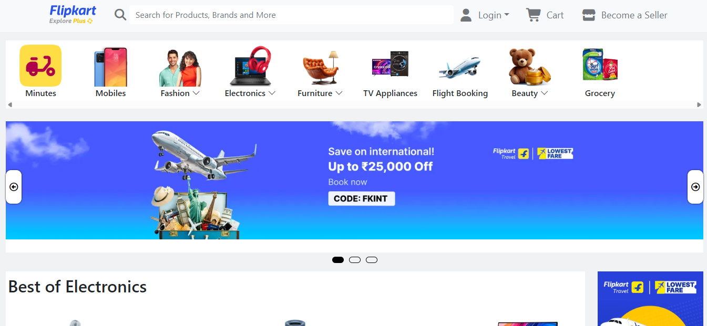

# FlipcartClone-JS

A JavaScript-based clone of the Flipkart e-commerce platform. This project demonstrates a modular approach to building a shopping website, including product listings, product details, and a shopping cart, with a focus on clean UI and responsive design.

---

## UI/UX

## 📁 Project Structure

### 1. `/assets`

Contains all static resources used throughout the project.

- **css/**: Stylesheets for the site, including:
  - `style.css`: Main styles for the homepage and general layout.
  - `cart.css`: Styles specific to the cart page.
  - `details.css`: Styles for the product details page.
  - `media.css`: Responsive design and media queries.
  - `bootstrap.min.css`: Bootstrap framework for UI components.
  - `remixicon.css`: Icon font for UI icons.
- **img/**: All images used in the project, such as banners, product images, logos, and category icons.
- **js/**:
  - `app.js`: Main JavaScript file handling UI interactions, product rendering, and cart logic.
  - `bootstrap.bundle.min.js`: Bootstrap’s JavaScript bundle for interactive components.

---

### 2. `/details`

Handles the product details functionality.

- **details.html**: The product details page. Displays detailed information about a selected product, including images, description, price, and an option to add to cart.
- **products.json**: A JSON file containing product data (name, price, image, description, etc.) used to dynamically populate product listings and details.

---

### 3. `/cartpage`

Manages the shopping cart experience.

- **cart.html**: The cart page. Shows products added to the cart, allows quantity updates, removal of items, and displays the total price.

---

## 📝 Features

- **Product Listing**: Browse a variety of products with images, prices, and quick details.
- **Product Details**: Click on a product to view its detailed information.
- **Shopping Cart**: Add products to the cart, update quantities, and remove items.
- **Responsive Design**: Fully responsive layout for mobile, tablet, and desktop.
- **Modern UI**: Uses Bootstrap and custom CSS for a clean, modern look.

---

## 🚀 Getting Started

1. **Clone the repository**  
   Download or clone this project to your local machine.

2. **Open `index.html`**  
   (Assuming you have an `index.html` at the root)  
   Open in your browser to start exploring the FlipcartClone-JS.

3. **Navigate**  
   - Browse products on the homepage.
   - Click a product to view details (`/details/details.html`).
   - Add products to your cart and view them in `/cartpage/cart.html`.

---

## 📂 Folder Overview

| Folder         | Description                                      |
|----------------|--------------------------------------------------|
| `assets/`      | Static files: CSS, JS, images                    |
| `details/`     | Product details page and product data            |
| `cartpage/`    | Shopping cart page                               |

---

## 🛠️ Technologies Used

- HTML5, CSS3, JavaScript (ES6)
- Bootstrap 5
- JSON for product data

---

## 📢 Notes

- This project is for educational/demo purposes and does not include backend or payment integration.
- All product images and data are for demonstration only.

---

## Live Link

https://flipcart-clone-js.vercel.app/